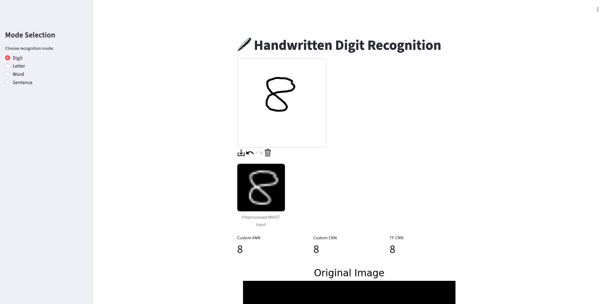
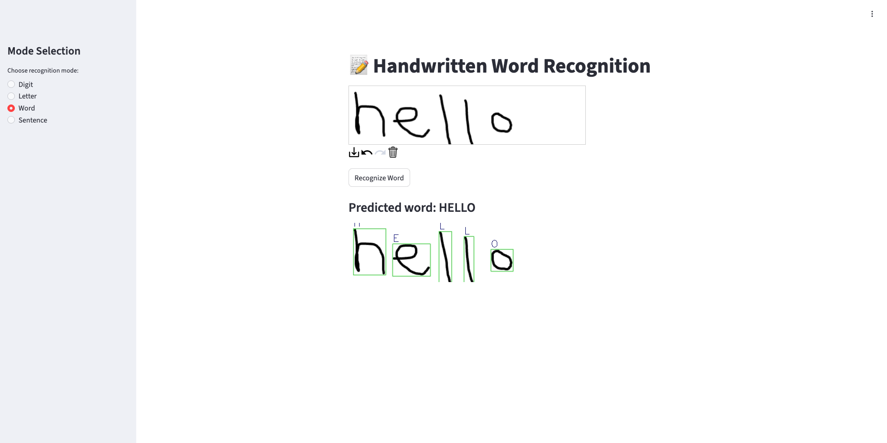

# Handwritten Character Recognition with Manual Neural Networks

This project explores handwritten character recognition through a deliberately low-level approach to neural networks. Instead of relying on high-level deep learning frameworks for the core model, a feed-forward neural network is implemented almost entirely from scratch using NumPy and trained on handcrafted edge-segment features derived from MNIST images.

To contextualize the results, a standard convolutional neural network (CNN) implemented in TensorFlow is included as a comparison baseline. An interactive Streamlit application ties both models together, allowing real-time visualization and experimentation.



---

## Motivation

Modern deep learning frameworks such as TensorFlow and PyTorch abstract away much of the complexity involved in training neural networks. While this abstraction is powerful, it can obscure *why* convolutional neural networks work so well and *what problems they solve compared to traditional architectures*.

The goal of this project was to reverse that dynamic by:

* Implementing a neural network **from first principles**
* Using **hand-engineered features** instead of learned convolutions
* Observing training instability, accuracy limits, and failure modes firsthand
* Comparing these results directly against a modern CNN

Rather than optimizing for accuracy alone, the focus was on understanding:

* feature engineering tradeoffs
* gradient behavior
* activation function dynamics
* architectural limitations
* why CNNs outperform traditional ANNs on image data

---

## Project Overview

The project consists of **two complete classification pipelines** and an interactive front end.

### 1. Manual Feed-Forward Neural Network (ANN)

A fully custom neural network implemented using NumPy, including:

* Forward propagation and backpropagation implemented by hand
* ReLU, tanh, and sigmoid activation functions
* Softmax output with cross-entropy loss
* Mini-batch gradient descent
* Xavier (Glorot) weight initialization
* Input standardization for training stability
* Model checkpointing via NumPy serialization
* Debugging instrumentation for activations and gradients

The ANN does **not** receive raw pixel data. Instead, it operates exclusively on handcrafted feature vectors.

---

### 2. Edge-Segment Feature Extraction

To meet the project constraints, image classification is performed using edge-based features rather than raw pixels.

The feature extraction pipeline:

1. Computes Sobel edges on 28×28 MNIST images
2. Divides the image into an N×N grid (e.g., 8×8)
3. Computes edge density within each segment
4. Produces a fixed-length feature vector (16–64 dimensions)

This enabled experimentation with:

* grid resolution vs. information loss
* sparse vs. dense feature vectors
* thresholding sensitivity
* failure modes when features collapse

---

### 3. TensorFlow CNN (Comparison Model)

A compact convolutional neural network implemented using TensorFlow/Keras serves as a performance and design baseline.

The CNN:

* Operates directly on raw pixel values
* Learns convolutional filters end-to-end
* Uses modern best practices (ReLU, pooling, dropout)
* Achieves near-state-of-the-art MNIST accuracy

The CNN is not the “primary” model; it exists to illustrate how much complexity modern frameworks manage automatically.

---

### 4. Interactive Streamlit Application

A Streamlit application provides a visual, interactive interface to the project:

* Users draw digits on a canvas
* Images are resized and normalized in real time
* Edge-segment features are computed live
* Feature vectors are visualized
* Predictions from both ANN and CNN are displayed side-by-side

This transforms the project from a static experiment into an exploratory tool for understanding model behavior.



---

## Project Structure

```
.
├── ann.py                # Manual ANN implementation
├── segments.py / extra.py # Edge detection & feature extraction
├── master.py             # Training, evaluation, visualization
├── app.py                # Streamlit interface
│   custom_ann_model.npz
│   tf_cnn_model.keras
└── README.md
```

The modular design enabled rapid experimentation with:

* activation functions
* feature vector sizes
* learning rates
* normalization strategies
* batch sizes
* initialization methods

---

## Key Challenges & Lessons Learned

### Feature Collapse

Many handwritten digits initially produced near-zero feature vectors, rendering the ANN ineffective. This required:

* adjusting Sobel thresholds
* tuning grid resolution
* visualizing segment densities
* recognizing the inherent fragility of handcrafted features

CNNs bypass this entirely by learning features automatically.

---

### Activation Function Behavior

* Sigmoid saturated almost immediately
* Tanh improved stability but still compressed gradients
* ReLU provided the best results but introduced dead neurons without standardization

These issues reinforced the importance of preprocessing and initialization.

---

### Gradient Instability

Without proper standardization, initialization, and mini-batch training, the network diverged or stagnated. Correcting these manually improved accuracy from ~9% to ~30%, demonstrating both the power and limits of shallow ANNs with engineered features.

---

### Understanding “Framework Magic”

The stark contrast between:

* a ~30% accurate manual ANN
* a ~99% accurate CNN

highlighted why convolutional architectures dominate vision tasks and how much optimization modern frameworks handle behind the scenes.

---

## Results

| Model              | Input Type                      | Train Accuracy | Test Accuracy |
| ------------------ | ------------------------------- | -------------- | ------------- |
| Manual ANN (NumPy) | Edge-segment features (64 dims) | ~30%           | ~29–30%       |
| TensorFlow CNN     | Raw pixels                      | ~97–98%        | ~98.8–99%     |

---

## Future Work

* Implement a true manual CNN with learnable filters
* Add momentum or Adam optimization to the ANN
* Explore alternative feature extraction (HOG, Canny, Gabor)
* Extend to EMNIST letters (A–Z)
* Add confusion matrices and saliency visualizations
* Expand analysis using Streamlit visual explanations

---

## Setup

```bash
pip install -r requirements.txt
```

```bash
streamlit run app.py
```

---

## References

* [https://en.wikipedia.org/wiki/Convolutional_neural_network](https://en.wikipedia.org/wiki/Convolutional_neural_network)
* [https://medium.com/advanced-deep-learning/cnn-operation-with-2-kernels-resulting-in-2-feature-mapsunderstanding-the-convolutional-filter-c4aad26cf32](https://medium.com/advanced-deep-learning/cnn-operation-with-2-kernels-resulting-in-2-feature-mapsunderstanding-the-convolutional-filter-c4aad26cf32)
* [https://www.geeksforgeeks.org/computer-vision/backpropagation-in-convolutional-neural-networks/](https://www.geeksforgeeks.org/computer-vision/backpropagation-in-convolutional-neural-networks/)
